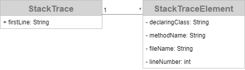

# Java Stack Trace Parser

> _Parses a java stack trace to access package, class, method, file, and line information of every stack trace element._

## Authors

<!--TODO: List all authors -->

- **Author** - *Initial work* - [alexscheitlin](https://github.com/alexscheitlin)

## License

This project is licensed under the [MIT License](LICENSE).
